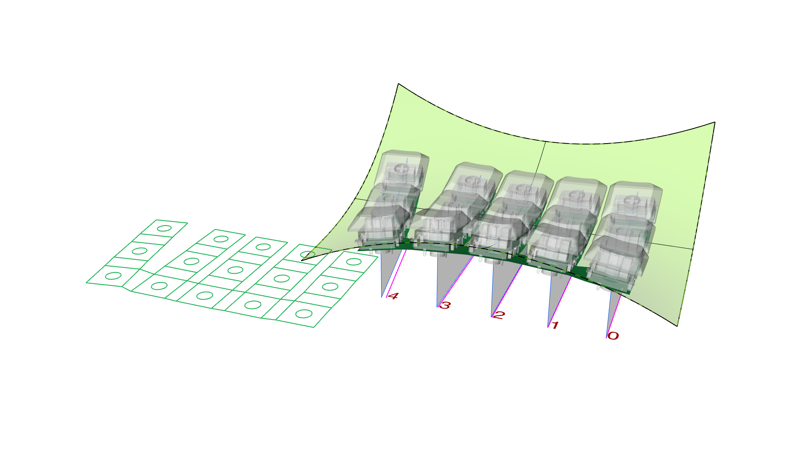
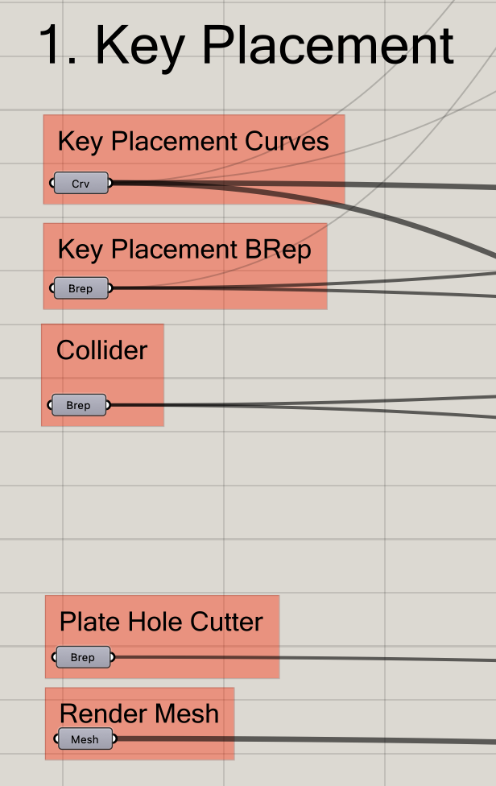
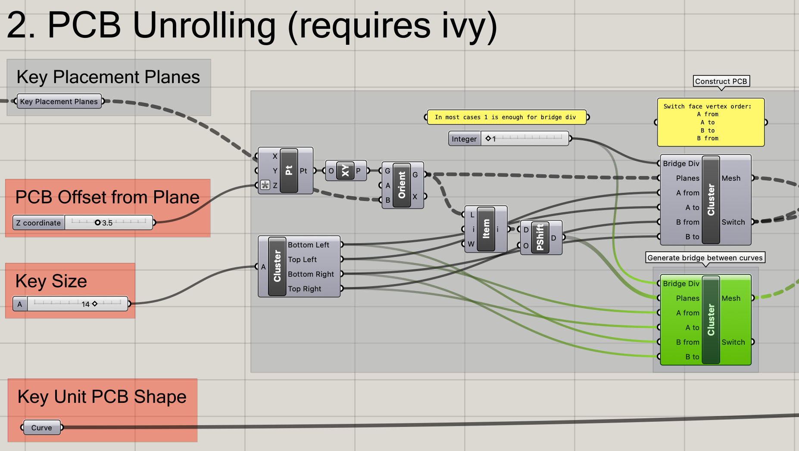

# Key switch placement script

[日本語版はこちら](./README_ja.md)

## About

This Grasshopper script places key switches on curved surface/BRep.

## Usage

See `key_placement.3dm` for example.

### Key placement

Set geometries used to generate keys. Following are required:

* `Key Placement Curves`: Curves which will be projected on the BRep along Z axis and then keys placed on.
* `Key Placement BRep`: A BRep which keys placed on.
* `Collider`: A BRep to be used to predicate if keys are colliding. This geometry is internally converted to a Mesh.

Set following geometry for convenience:

* `Plate Hole Cutter`: A BRep to cut switch placing holes.
* `Render Mesh`: A render model of key switch.

#### Limitations

* If keys are generated downwards, use `flip` command to flip the normal of the BRep.
* Curve spacing is adjusted by offsetting curves on XY plane. Adjustment order is determined by input order.
    * To set order, select `Set Multiple curves` in GH then select curves in Rhino by desired order.

### 基板の生成 (Experimental)

Computes outline and key location of unrolled PCB. Requires [`Ivy`](https://www.food4rhino.com/en/app/ivy).

#### Limitations

* Estimates PCB shape using planar mesh. Error might be larger if there is large amount of curve or twist.
* Bridges are generated using the order of input curve in Step 1.
    * If curve is not ordered from right to left, wrong shape PCB will be generated. In such case, Sort the input `Planes` of `Generate bridge between curves` component (highlighted green) correctly.