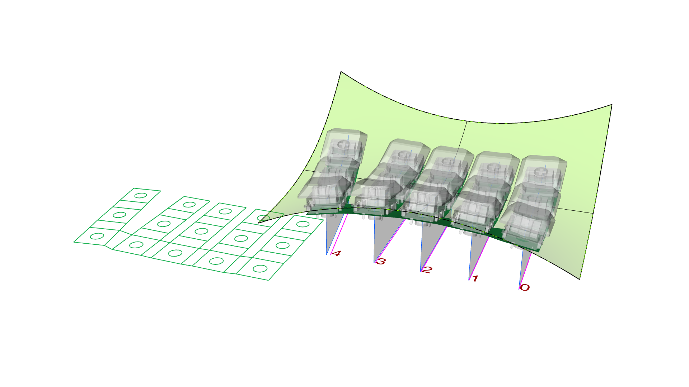
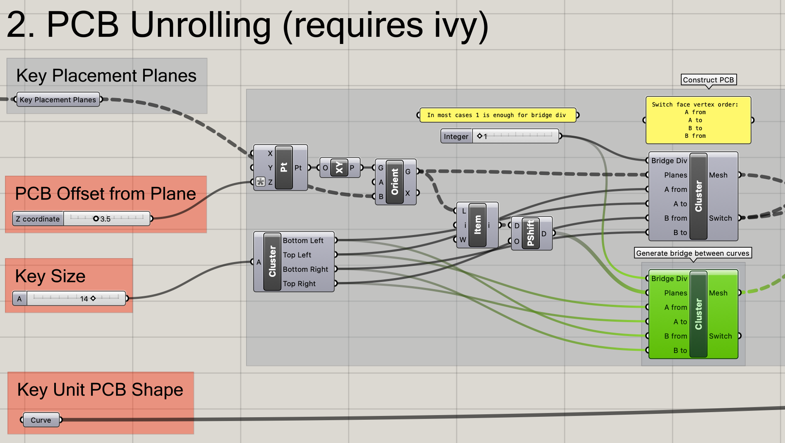

# キースイッチ配置スクリプト

## これは何 

Rhino/GH で曲面上にキースイッチを並べるための Grasshopper スクリプトです。

## 使い方

サンプルファイル `key_placement.3dm` を参照してください。

### キーの配置

生成に使うジオメトリを設定します。最低限以下のものの設定が必要です。

* `Key Placement Curves`: キーが配置されるXY平面上のカーブ。内部でZ軸方向にBRepに投影されます
* `Key Placement BRep`: キーが配置されるBRep
* `Collider`: キーの衝突判定に使われるBRep。内部でメッシュに変換されます

以下を設定しておくと、このあとの工程で便利です。

* `Plate Hole Cutter`: プレートに穴を切り抜くためのBRep
* `Render Mesh`: キー一式のレンダリング用モデル

#### 制限

* キーが裏向きに生成されるときは `flip` コマンドで面の向きを反転させてください。
* カーブの間隔調整は、カーブをXY平面上でオフセットすることで行っています。間隔調整の順序はGHへの入力順です。
    * 順序を設定するには、`Set Multiple Curves`をGH上で選択したあと、Rhino側でカーブを並べたい順に選択してください。

### 基板の生成 (Experimental)

基板外形・キーの位置を生成します。 [`Ivy`](https://www.food4rhino.com/en/app/ivy) のインストールが必要です。

#### 制限

* 基板を平面メッシュで近似しています。面の曲がりやねじれがきつい場合、誤差が大きくなる可能性があります。
* Step 1 で生成したカーブの順序で基板をブリッジします。
    * カーブが右から左に並んでいない場合、誤った形の基板が生成されます。その場合、カーブ間のブリッジを生成しているクラスタ（図で緑色にハイライトされている部分）の入力の`Planes`を正しく並べ替えてください。
